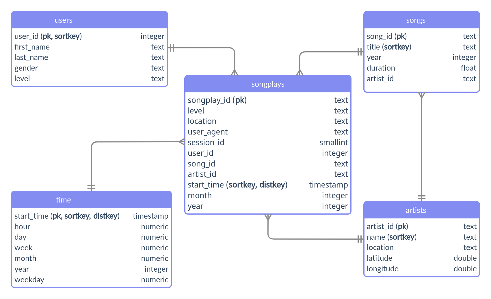

# Data Pipelines with Airflow & AWS Redshift

---

> Author: Rodrigo de Alvarenga Mattos 

## Introduction

The intent of this project is to build an automated ETL pipeline using Apache Airflow. The data is a numerous set of small JSON files, stored in AWS S3, that must be loaded into AWS Redshift according to the star schema described in the Table Schema section. The pipeline was built from reusable tasks and the data quality check can be easily extended to connect with any database.

## Auto-generate API Documentation

The [Sphinx](https://www.sphinx-doc.org) documentation generator was used to build the [HTML docs](http://htmlpreview.github.io/?https://github.com/rodrigoalvamat/certification-dataeng-airflow/blob/main/docs/build/html/index.html) from the source code ```DOCSTRIGS```.

## Project Dependencies

- [Apache Airflow 2.4.1](https://airflow.apache.org/docs/apache-airflow/2.4.1/start.html)

- [Pipenv 2022.10.25](https://pipenv.pypa.io/en/latest/)

- [Python 3.10](https://www.python.org)

- [Terraform 1.2.9](https://www.terraform.io)

- [Sphinx 5.3.0](https://www.sphinx-doc.org)
1. The Pipenv package manager was used to install and manage dependencies.

```bash
# install pipenv for dependency management
pip install pipenv

# install project dependencies from Pipfile
pipenv install
```

2. You can also use pip to install dependencies from the requirements.txt file.

```bash
pip install -r requirements.txt
```

3. Install Apache Airflow using docker compose:

```bash
make docker
```

## AWS Services and Resources

This is the list of services that have been provisioned in the AWS cloud:

| Service      | Resources                    | Description                              |
| ------------ | ---------------------------- | ---------------------------------------- |
| **IAM**      | Policy                       | Redshift policy.                         |
| **IAM**      | Role and User                | Redshift role and user.                  |
| **S3**       | Data Lake Bucket             | Storage data source.                     |
| **VPC**      | Subnet Group and VPN Gateway | Redshift virtual networking environment. |
| **VPC**      | Security Group               | Redshift inbound and outbound traffic.   |
| **Redshift** | EC2 instances.               | Customized cloud data warehouse.         |

## Terraform Infrastructure as a Code

We used Terraform to automate infrastructure provisioning, including servers, network, permissions, and security. Please follow the instructions below before running Terraform commands:

1. Check if you have terraform installed or follow the [instructions in the website](https://learn.hashicorp.com/tutorials/terraform/install-cli):

```bash
terraform version
```

2. Make sure you have the [AWS Command Line Interface](https://aws.amazon.com/cli) installed, the user is logged in and the default region is set:

```bash
# check the current user
aws iam get-user

# the default region should be set
aws configure get region
```

3. Initialize the Terraform working directory containing configuration files:

```bash
make init
```

4. Apply Terraform configuration to provision AWS services and resources:

```bash
make apply
```

## Apache Airflow Webserver Configuration

Before running the ETL pipeline, you must log in to the Airflow UI to set up the AWS credentials and the Redshift connection.

1. Open your browser, navigate to the Airflow UI on [http://localhost:8080](http://localhost:8080), and sign in with the following credentials:

| username | password |
| -------- | -------- |
| airflow  | airflow  |

2. Navigate to the top main menu section Admin and click connections. Click the plus [+] button to add a new record according to the following settings:

| Option                | Value                                                                |
| --------------------- | -------------------------------------------------------------------- |
| Connection Id         | aws_credentials                                                      |
| Connection Type       | Amazon Web Services                                                  |
| AWS Access Key ID     | A valid aws_access_key_id stored on your ~/.aws/credentials file     |
| AWS Secret Access Key | A valid aws_secret_access_key stored on your ~/.aws/credentials file |
| Extra                 | { "region_name": "us-west-2" }                                       |

3. Click the plus [+] button to add a new record according to the following settings:

| Option          | Value                                                                                                                    |
| --------------- | ------------------------------------------------------------------------------------------------------------------------ |
| Connection Id   | redshift                                                                                                                 |
| Connection Type | Amazon Redshift                                                                                                          |
| Host            | Use the host name, without the port section, exported by terraform to the [./config/redshift.cfg](./config/redshift.cfg) |
| Schema          | dwh                                                                                                                      |
| Login           | dwhuser                                                                                                                  |
| Password        | Use the password set in the [./terraform/secret.tfvars](./terraform/secret.tfvars)                                       |
| Port            | 5439                                                                                                                     |

## Airflow ETL Pipeline DAG

We've created a set of custom operators, for each step of the ETL pipeline, and defined their dependencies within the Airflow DAG as shown in the graph below:

<div style='background-color:#fff;padding:24px;'>

</div>

The following table describes each process related to the ETL pipeline:

| Step                  | Action                                                             |
| --------------------- | ------------------------------------------------------------------ |
| Stage to Redshift     | Copy JSON data from S3 and load into stage tables on Redshift.     |
| Load Fact Table       | Transform and load data from stage tables to the fact table.       |
| Load Dimension Tables | Transform and load data from stage tables to the dimension tables. |
| Data Quality Check    | Validade every table column in fact and dimension tables.          |

## JSON Raw Data

The figure below shows how the JSON raw data was loaded into the stage tables and their schema.

<div style='background-color:#fff;padding:24px;'>

</div>

## Database Schema Design

The Redshift database is modeled as a star schema that consists of a fact table (songplays) referencing four dimension tables (artists, songs, time, users).

The figure below shows the database structure as an entity relationship diagram:

<div style='background-color:#fff;padding:24px;'>

</div>

## Data Quality Check

The data quality check was declared in a JSON file [./dags/quality_check.json](./dags/quality_check.json) as an array of validation rules for each tables' column of the database schema as follows:

| Column Rule Type | Action                                                   |
| ---------------- | -------------------------------------------------------- |
| regexp           | Get the number of rows that match the regular expression |
| timestamp        | Get the number of rows that have a timestamp value       |
| nullable         | Get the number of rows with null values                  |
| any              | Get the number of rows since any value is valid          |

Sample quality check rules for the artist table:

<div style='background-color:#fff;padding:24px;'>

</div>

## Trigger the DAG

1. Before triggering the DAG, update the start date (year, month, day) in the pipeline configuration file [./dags/pipeline.cfg](./dags/pipeline.cfg) and set with the current date.

2. Go to the Airflow UI home page [http://localhost:8080/home](http://localhost:8080/home) and click on the Trigger Dag action button [>] on the right side of the DAG list panel.

<div style='background-color:#fff;padding:24px;'>

</div>

3. Follow the DAG execution using the Grid and the Graph view. 

4. At the end of a successful run, go to the Admin section of the main menu and click on XCom. The quality_check output will be stored as a JSON string with the following content:

<div style='background-color:#fff;padding:24px;'>

</div>